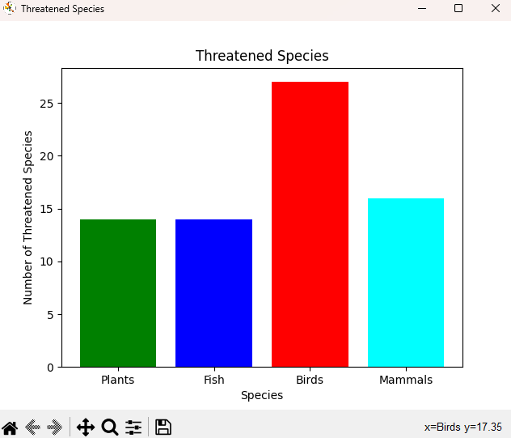

# Country_Information_Data_Plot
A console (terminal-based) application that imports multiple CSV files and displays their data using NUMPY and MATPLOTLIB.
For this program to run, the numpy and matplotlib modules must be installed on the compiler, and the 3 CSV files must be in the same directory that the python file is located in.

# What I learned
* Create and manipulate arrays using the numpy module
* Manipulate and execute numpy array computations
* Plot data using the matplotlib module
* Create an object instance using a given class
* Use instance methods for a given class
* Create an intuitive user interface
---

# How the program runs

The program reads multiple CSV files that contain information regarding every country, and its continental region, land size, endangered species, etc.
The user is prompted to select from a list of choices where they can filter by UN region, UN-sub region or just by the name of the country.

---
After the country has been selected, a collection of bar graphs and line graphs that visualizes information about a country's population and endangered species can be viewed.
 

 

